# AD Posture


AD Posture is a local Active Directory posture and privilege audit toolkit focused on sensitive groups, nested access chains, Tier 0/1/2 exposure, cumulative risk scoring, dashboards, exports, and remediation planning.

AD Posture is delivered as the `ADPosture` PowerShell module. The public v1 API uses AD Posture command names from the start.

AD Posture complements Microsoft Defender for Identity (MDI), SIEM, GRC, and EDR platforms by producing local posture evidence and remediation context. It does not provide continuous collection, real-time detection, alerting, or a certified regulatory assessment.

## Highlights

- Sensitive group audit for built-in, domain, forest, Exchange, and optional groups.
- SID-first group resolution by well-known RID, so localized (for example pt-BR) and renamed built-in groups are still found.
- Full nested membership chain resolution with member-attribute fallback when `Get-ADGroupMember` cannot enumerate a group.
- Automatic Tier 0 / Tier 1 / Tier 2 classification from `config\TieringModel.json`.
- Cumulative risk score from 0 to unlimited, where 0 means nothing to correct.
- Per-finding score explanation with formula, score components, and technical risk context.
- MITRE ATT&CK technique mapping for privileged group exposure patterns.
- Readiness / scorecard view for Tier 0 exposure, UAC hygiene, stale identities, nesting, and expired approvals.
- Object Risk view for object-level risk profiles, evidence, relationships, and remediation context.
- gMSA/sMSA recognition as service accounts instead of `Unknown`.
- Native AD identity handling for built-in, well-known, and architecture-managed principals.
- Approved baseline exceptions with owner, approver, ticket, reason, and expiry.
- Friendly UAC labels such as `Normal Account, Weak Kerberos (DES)`.
- Operations, Objects, Exceptions, Timeline, and Executive dashboards with persona-specific views.
- Static local dashboards backed by the generated embedded report bundle.
- Optional ACL posture for dangerous ACEs and unexpected owners on the domain root, AdminSDHolder, and scanned sensitive groups.
- Optional ADCS posture for risky certificate templates, published CAs, CA policy configuration, broad enrollment, enrollment-agent exposure, exportable authentication private keys, broad template/CA/NTAuth control delegation, Any Purpose/no-EKU exposure, and ESC-style attack paths.
- Dark operations dashboard with tier donut, remediation bars, account type mix, top group exposure, fix impact, account exposure, and expandable access-path details.
- CSV/JSON exports plus embedded dashboard data for local HTML viewing.
- Synthetic demo mode for first-run exploration without an audit.
- Pester tests, PSScriptAnalyzer settings, and GitHub Actions CI.

## Demo

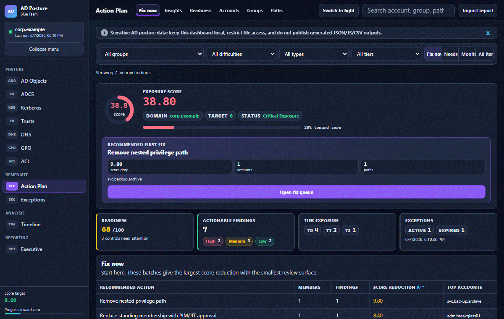

## Screenshots

### Operations

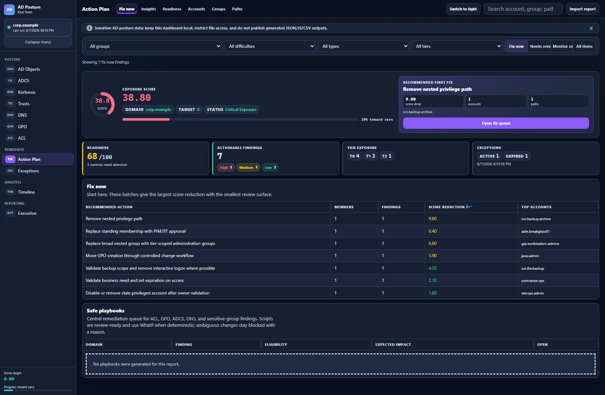

### Objects

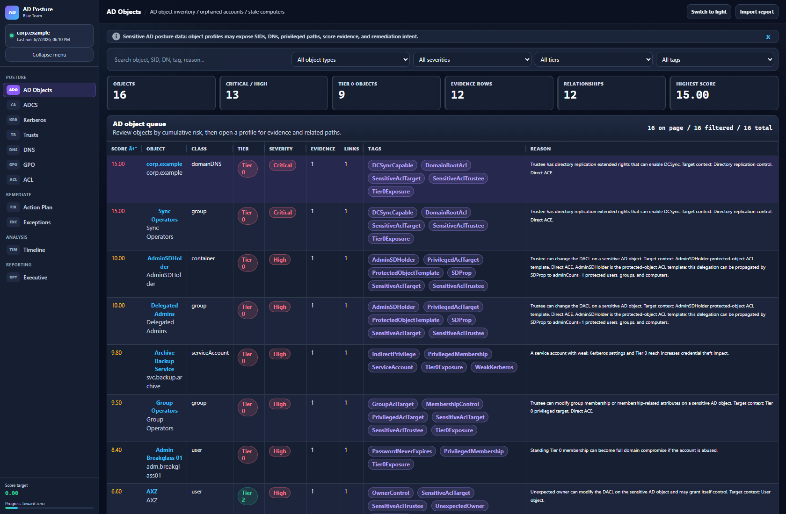

### Auth / Kerberos

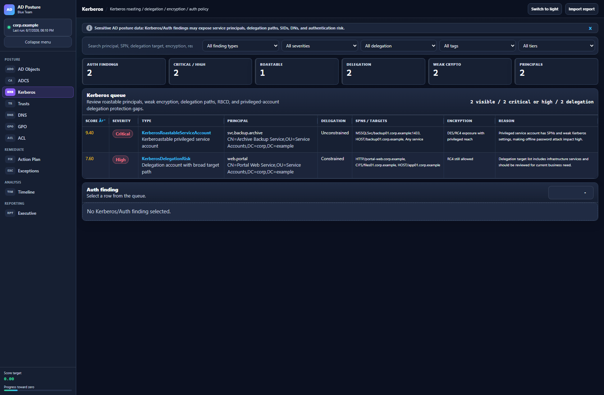

### ACL Posture

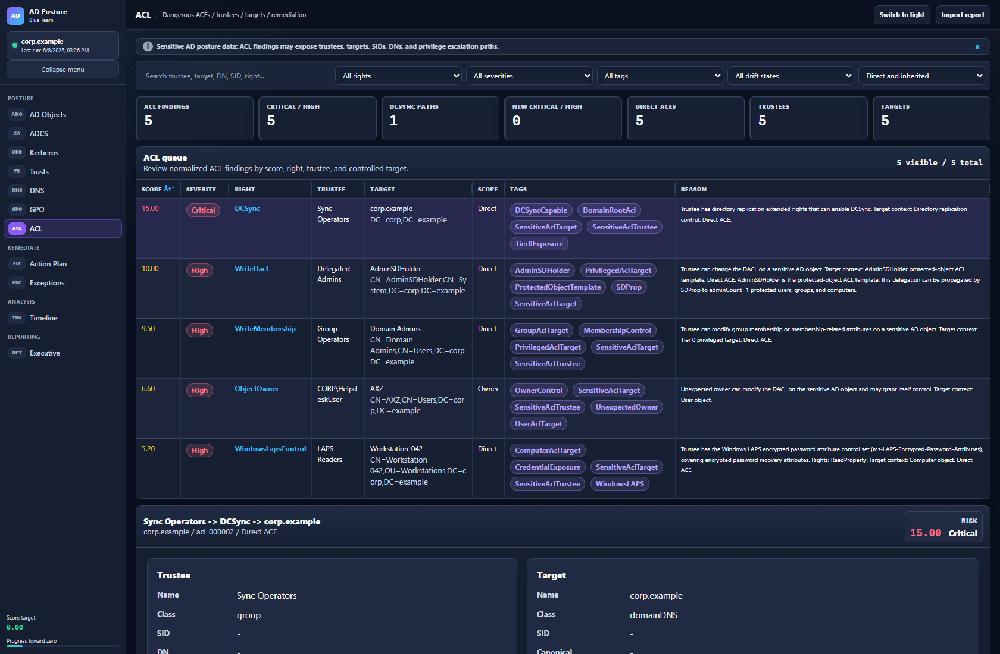

### GPO Posture

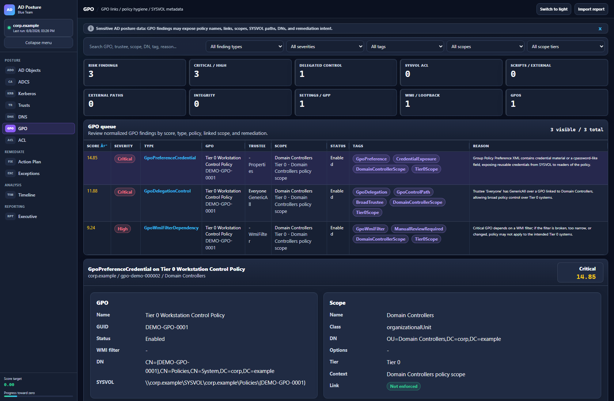

### ADCS Posture

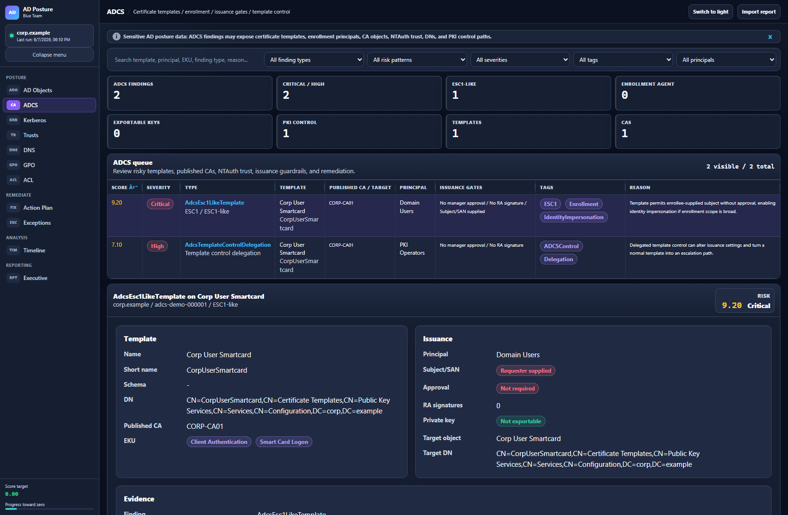

### Trusts

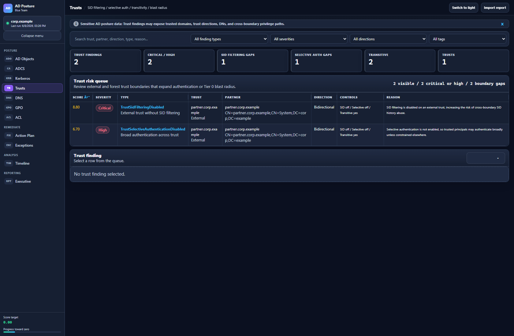

### DNS

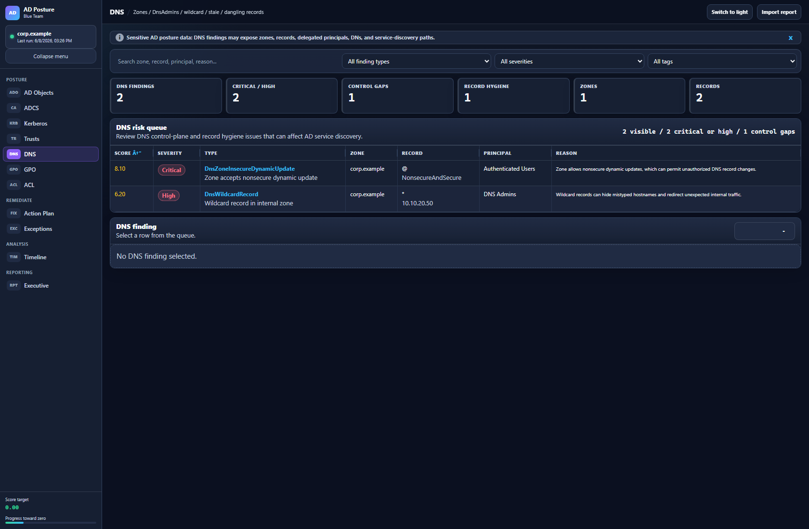

### Executive

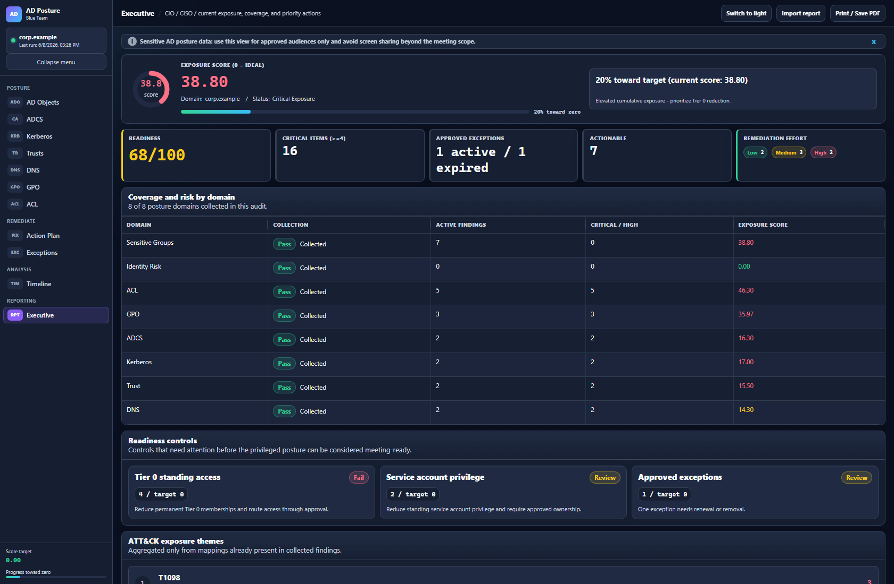

### Exceptions

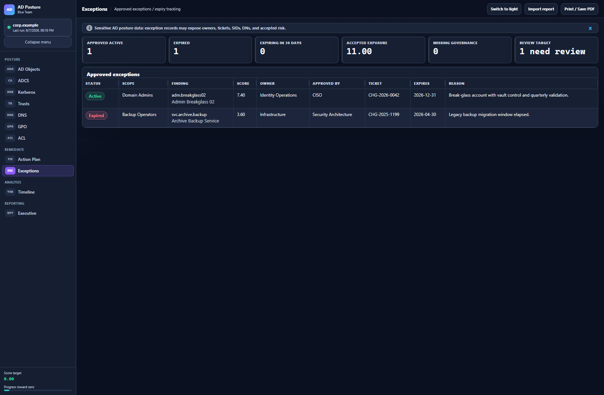

### Timeline

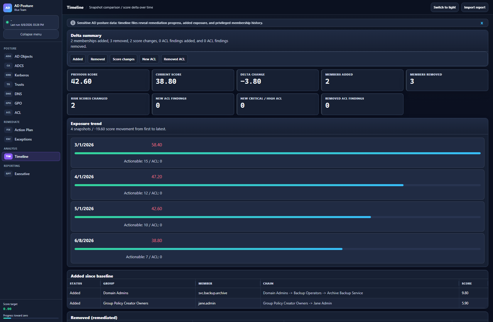

## Requirements

- Windows with RSAT / Active Directory Administration Tools
- PowerShell 5.1+
- `ActiveDirectory` module
- AD read permissions

Install RSAT example:

```powershell
Get-WindowsCapability -Online | Where-Object Name -like '*RSAT*ActiveDirectory*'
Add-WindowsCapability -Online -Name Rsat.ActiveDirectory.DS-LDS.Tools~~~~0.0.1.0
```

## Download

Run from a hardened management workstation or jump server, not from an interactive Domain Controller session as the default operating model.

Clone with Git:

```powershell
git clone https://github.com/wgerade/AD-Posture.git
cd AD-Posture
```

Or download the repository ZIP from GitHub, extract it to a controlled local folder, then open PowerShell in that folder. If Windows marks downloaded files as internet-origin content, unblock the extracted project files before importing the module:

```powershell
Get-ChildItem -Recurse | Unblock-File
```

Confirm the module loads and review the public commands:

```powershell
Import-Module .\ADPosture.psd1 -Force
Get-Command -Module ADPosture
```

## Quick Start

```powershell
Import-Module .\ADPosture.psd1 -Force

$snapshot = Invoke-ADPostureAudit -Verbose
Open-ADPostureDashboard -View Current
```

Audit a specific DC or domain:

```powershell
Invoke-ADPostureAudit -Server 'dc01.contoso.com'
```

Run every collector and broad expansion:

```powershell
Invoke-ADPostureAudit -Full
.\scripts\Invoke-ADPostureAudit.ps1 -Full -OpenExecutive
```

`-Full` means maximum v1 collection. It enables optional groups, full ACL posture including all objects, GPO posture with SYSVOL ACL review, ADCS, Kerberos/Auth, Trust, and DNS. Use it when the operator accepts the runtime and DC/jump-server pressure of broad collection.

Large environments should stage broad collection by domain or OU/subtree, run from a dedicated audit workstation, and observe DC, LDAP, CPU, memory, and storage impact. `-Full` and unthrottled ACL expansion are not routine defaults for busy production environments.

## Safe Operation From a Management Server

Run AD Posture from a hardened management workstation or controlled jump server with RSAT installed. Do not use an interactive Domain Controller session as the default operating model; the collectors are read-only, but broad LDAP, ACL, SYSVOL, DNS, trust, and PKI enumeration still consume CPU, memory, network, and directory service resources.

Recommended operating pattern:

```powershell
Import-Module .\ADPosture.psd1 -Force

# Start with focused read-only posture.
Invoke-ADPostureAudit `
  -IncludeOptionalGroups `
  -IncludeKerberosAuthPosture `
  -IncludeTrustPosture `
  -IncludeDnsPosture `
  -LogPath .\reports\audit.log

# Add heavier collectors only after approval and pacing review.
Invoke-ADPostureAudit `
  -IncludeAclPosture `
  -IncludeAclAllObjects `
  -IncludeGpoPosture `
  -IncludeGpoSysvolAcl `
  -IncludeAdcsPosture `
  -AclReadDelayMilliseconds 100 `
  -LogPath .\reports\audit-full.log
```

Minimum access depends on selected collectors:

- Base membership, identity, Kerberos/Auth, Trust, and DNS posture require AD read visibility for the domain and selected objects.
- GPO/SYSVOL posture requires read access to GPO containers, linked scopes, and SYSVOL policy files.
- ADCS posture requires read access to Configuration naming context PKI objects and certificate template / Enrollment Services metadata.
- Broad ACL collection should be staged by OU or subtree first, then widened only when the runtime and directory-service impact are understood.

EDR, Defender, and security tooling should be handled through normal change governance, not ad hoc bypass. Pre-register the tool directory, expected PowerShell module path, output paths under `reports\` and `data\`, hashes/signature information when available, expected logging behavior, and the approved operator identity with the security operations team before production execution.

Pipeline support:

```powershell
'dc01.contoso.com', 'dc02.contoso.com' | Invoke-ADPostureAudit -Verbose
Get-ADDomainController -Filter * | Invoke-ADPostureAudit -LogPath .\reports\audit.log
```

Include optional groups:

```powershell
Invoke-ADPostureAudit -IncludeOptionalGroups
```

Tune hygiene thresholds for your environment:

```powershell
Invoke-ADPostureAudit -StaleDays 180 -PasswordAgeDays 730
Invoke-ADPostureAudit -PasswordAgeDays 0  # Disable password-age findings
```

`-StaleDays` controls when an account with no logon is treated as unused. `-PasswordAgeDays` controls when password age is called out in remediation guidance; use `0` if password age is handled by a separate control.

`lastLogonTimestamp` is replicated and intentionally approximate. Depending on domain replication and update cadence, it can lag actual activity by days. Treat stale-account results as review candidates and validate critical identities against authoritative operational evidence before remediation.

Include the ACL posture preview:

```powershell
Invoke-ADPostureAudit -IncludeAclPosture
```

Include the GPO posture preview:

```powershell
Invoke-ADPostureAudit -IncludeGpoPosture
Invoke-ADPostureAudit -IncludeGpoPosture -GpoSearchBase 'OU=Servers,DC=contoso,DC=local'
Invoke-ADPostureAudit -IncludeGpoPosture -IncludeGpoSysvolAcl
```

GPO posture reads GPO containers and linked domain/OU scopes, then reports risky GPO integrity and control-path findings. Enforced links, disabled links, disabled GPO sections, script-extension metadata, and orphaned link inventory are retained as context/inventory instead of generating standalone risk queue alerts. When `-IncludeAclPosture -IncludeAclGpoContainers` is also used, dangerous GPO delegation ACLs are correlated with each linked scope so the same GPO permission is scored differently on `OU=Domain Controllers` than on a normal OU. Use `-GpoSearchBase` to stage OU link discovery in larger environments.

`-IncludeGpoSysvolAcl` adds filesystem validation for GPO SYSVOL folders, parses configured GPO script execution paths as context, scans standard GPO script folders, and checks configured script files/folders that live inside SYSVOL. Script presence by itself is not a risk finding. It also reports external script paths discovered from GPO metadata files, selected risky settings from `GptTmpl.inf`, and risky script-content patterns inside SYSVOL. It reads ACLs only from the GPO SYSVOL tree; external file server paths are reported as out-of-scope execution dependencies and are not contacted for ACL validation. It does not compare SYSVOL ACL drift across DCs.

GPO security filtering is read from Apply Group Policy ACL entries. Broad apply principals are reported only on critical or infrastructure scopes; default `Authenticated Users` alone is treated as context rather than a standalone finding.

Include the ADCS posture preview:

```powershell
Invoke-ADPostureAudit -IncludeAdcsPosture
```

ADCS posture reads certificate templates, Enrollment Services CA objects, template publication state, NTAuthCertificates, and best-effort CA registry/policy configuration. It reports high-risk template patterns such as broad authentication enrollment, broad authentication autoenrollment, ESC1-like enrollment paths, Any Purpose/no-EKU broad issuance, broad enrollment-agent issuance, exportable authentication private keys, broad template-control delegation, broad Enrollment Services CA object control, broad NTAuth control, and ESC6-style CA request-SAN configuration/chains. It remains opt-in because PKI data is sensitive and enterprise CA environments can vary heavily.

Expand ACL target collection explicitly when you want broader coverage:

```powershell
Invoke-ADPostureAudit -IncludeAclPosture -IncludeAclOrganizationalUnits -IncludeAclGpoContainers
Invoke-ADPostureAudit -IncludeAclPosture -IncludeAclPrivilegedUsers -IncludeAclPrivilegedComputers -IncludeAclPrivilegedGroups
Invoke-ADPostureAudit -IncludeAclPosture -IncludeAclAllObjects
Invoke-ADPostureAudit -IncludeAclPosture -IncludeAclAllObjects -AclReadDelayMilliseconds 25
Invoke-ADPostureAudit -IncludeAclPosture -AclSearchBase 'OU=Privileged,DC=contoso,DC=local'
```

Broad ACL collection is sequential and emits progress for target discovery, ACL reads, and local risk classification. After `ACL posture collection complete`, AD reads are finished; remaining work is local classification of raw ACEs. Use `-AclReadDelayMilliseconds` in production-like environments when you want to reduce sustained DC or jump-server pressure.

ACL findings remain complete in the report exports. To keep the static dashboard responsive on broad scans, the dashboard payload shows effective trustee count plus a small sample for each ACL finding. The full effective trustee expansion is exported separately in `reports\audit-*-acl-effective-trustees.csv` for cleanup and owner review.

Operational guidance for broad ACL scans:

- Prefer staged collection with `-AclSearchBase` per OU/subtree before using `-IncludeAclAllObjects` across the whole domain.
- Run broad scans from a dedicated management or audit workstation, not interactively on the primary domain controller.
- Use a maintenance window or low-traffic period for large domains.
- Start with a conservative delay such as `-AclReadDelayMilliseconds 100` or higher, then tune down only after observing CPU, memory, disk, and LDAP/DC response.
- Treat `-AclReadDelayMilliseconds 0` as synthetic-test only. Full-domain ACL collection can be a practical stress test for a VM, jump server, or domain controller.
- Keep generated reports in a restricted location; ACL reports expose trustees, targets, DNs, SIDs, privileged paths, and remediation context.

Validate DNS parser v2 evidence after a lab audit:

```powershell
Invoke-ADPostureAudit -IncludeDnsPosture
.\scripts\Test-ADPostureDnsV2Validation.ps1 -RequireParsedDnsRecords
```

The validation script is read-only. It summarizes parsed DNS record coverage, DNS v2 finding types, and generated JSON payload shape.

## Posture Finding Routing

Reportable issues are routed into the posture domains that own the risk:

- `MachineAccountQuota > 0` is outside the active v1 posture domains.
- `krbtgt` rotation age or missing local password evidence is reported by Kerberos/Auth.
- Privileged `SIDHistory` is reported as object-risk evidence and appears in the Action Plan.

Telemetry-only attack paths are not emitted as automatic findings until an event or SIEM integration can prove them. Use the primary dashboard views such as Auth, ACL, ADCS, Trust, DNS, GPO, Object Risk, Action Plan, and Executive for operational reporting.

## Outputs

| Artifact | Description |
| --- | --- |
| `data\snapshot-*.json` | Historical full snapshot for timeline and forensics |
| `data\latest-snapshot.json` | Stable alias for the latest full snapshot, useful for post-audit commands and timeline review |
| `reports\audit-*-findings.csv` | Detailed findings |
| `reports\audit-*-groups.csv` | Group-level exposure |
| `reports\audit-*-acl-findings.csv` | ACL posture findings when ACL posture is included |
| `reports\audit-*-acl-effective-trustees.csv` | Full expanded effective ACL trustee detail when ACL posture expansion is available |
| `reports\audit-*-adcs-findings.csv` | ADCS posture findings when ADCS posture is included |
| `reports\audit-*-adcs-cas.csv` | ADCS Enrollment Services / issuing CA inventory when ADCS posture is included |
| `reports\audit-*-identity-risk-findings.csv` | Identity risk findings such as privileged SIDHistory |
| `reports\audit-*-dashboard.json` | Dashboard payload |
| `reports\latest-dashboard.json` | Latest dashboard data |
| `dashboard\dashboard-data.js` | Embedded data for local `file://` dashboard use |
| `config\ApprovedExceptions.json` | Governed sensitive-group baseline exceptions |

By default all generated artifacts are written under the module folder. When the module is installed in a read-only location (for example a `PSModulePath` under `Program Files`), set the `ADPOSTURE_OUTPUT_ROOT` environment variable to a writable working directory. `data\`, `reports\`, the dashboard bundle, and the operator-managed `config\ApprovedExceptions.json` are then created under that root, and `Open-ADPostureDashboard` copies the static dashboard pages there automatically:

```powershell
$env:ADPOSTURE_OUTPUT_ROOT = 'D:\ADPosture-Workspace'
Invoke-ADPostureAudit
Open-ADPostureDashboard -View Current
```

Generated artifacts have no automatic retention or destructive cleanup policy. Store them only on access-controlled, preferably encrypted storage; define retention and disposal according to local governance; and manually remove snapshots, reports, dashboard payloads, timeline files, screenshots, logs, and remediation scripts when their approved retention period ends. Review the target paths before deletion.

## Dashboards

```powershell
Open-ADPostureDashboard -View Current
Open-ADPostureDashboard -View ObjectRisk
Open-ADPostureDashboard -View AdcsPosture
Open-ADPostureDashboard -View KerberosAuthPosture
Open-ADPostureDashboard -View TrustPosture
Open-ADPostureDashboard -View DnsPosture
Open-ADPostureDashboard -View AclPosture
Open-ADPostureDashboard -View GpoPosture
Open-ADPostureDashboard -View Exceptions
Open-ADPostureDashboard -View Timeline
Open-ADPostureDashboard -View Executive
```

`Open-ADPostureDashboard` opens the selected local HTML page directly. It refreshes `dashboard-data.js` from `reports\latest-dashboard.json` only when the embedded bundle is missing or older than the report. No localhost service or persistent PowerShell process is started. The Objects view paginates its local table at 100 rows while KPIs and profiles continue to use the complete embedded report.

When no generated audit data exists (for example a fresh clone), the dashboards fall back to an embedded synthetic `corp.example` demo bundle and show a visible "synthetic demo data" banner. Demo data never mixes with generated audit output: real audits write `dashboard-data.js`, which always takes precedence. The guided tour script (`dashboard/tour.js`) is not loaded by the product pages; it is reserved for the public demo page.

Manual pages:

- `dashboard\index.html`: operations queue with fix impact, account exposure, group exposure, correctable/native scope toggle, smarter search, sticky score column, expandable score/ATT&CK/UAC/identity details, and script download.
- `dashboard\objects.html`: object-level queue with cumulative object score, tags, profile evidence, relationship paths, and remediation focus.
- `dashboard\adcs.html`: ADCS posture queue with risky certificate templates, published CAs, broad enrollment, issuance guardrails, enrollment-agent exposure, Any Purpose/no-EKU exposure, template/CA/NTAuth control delegation, and ESC-style attack-path detail.
- `dashboard\auth.html`: Kerberos/Auth posture queue with roastable principals, delegation exposure, RBCD, weak encryption, and privileged-account delegation protection gaps.
- `dashboard\trusts.html`: Trust posture queue with SID filtering gaps, selective authentication gaps, transitivity, forest trust blast radius, TGT delegation, and stale trust governance. `dashboard\trust.html` remains a lightweight redirect entry.
- `dashboard\dns.html`: DNS posture queue with AD-integrated zone controls, DnsAdmins exposure, DNS ACL delegation, wildcard/stale/dangling records, parsed `dnsRecord` evidence, and record hygiene.
- `dashboard\acl.html`: ACL posture queue with normalized dangerous rights, trustee/target review, inheritance filters, remediation focus, and bounded effective-trustee samples; complete effective-trustee detail is exported to CSV.
- `dashboard\gpo.html`: GPO posture queue with delegated-control findings, scope-tier filters, risky SYSVOL/path findings, and remediation focus.
- `dashboard\exceptions.html`: approved business exceptions, accepted exposure, expiring approvals, and missing governance fields separated from the remediation queue.
- `dashboard\timeline.html`: score trend, score delta, and membership changes across audits.
- `dashboard\executive.html`: meeting-ready posture summary with readiness controls, top remediation moves, approved exception count, exposure progress, and print/save-PDF export.

## Object Risk Explorer

The object posture track is documented in `docs\OBJECT-RISK-EXPLORER.md`. The current static snapshot now includes `Objects`, `ObjectEvidence`, and `ObjectRelationships`, and `dashboard\objects.html` exposes the object-level review workflow for users, groups, computers, service accounts, OUs, GPOs, sensitive containers, and posture evidence.

`-IncludeAclPosture` adds the first ACL evidence family to that object model. It reads the domain root, AdminSDHolder, and scanned sensitive group ACLs, then normalizes high-impact rights such as `GenericAll`, `GenericWrite`, `WriteDacl`, `WriteOwner`, `AllExtendedRights`, password reset, DCSync replication extended rights, membership/SPN writes, legacy Microsoft LAPS, Windows LAPS, secret attribute access, delete rights, and unexpected object owners into object evidence and relationships. Additional ACL target families are controlled by explicit switches for Organizational Units, GPO containers, AdminSDHolder-protected users, AdminSDHolder-protected computers, AdminSDHolder-protected groups, all domain users/groups/computers/OUs/GPO containers with `-IncludeAclAllObjects`, or selected subtrees with `-AclSearchBase`. ACL scoring is context-aware: Tier 0 targets keep full severity, while broad findings on ordinary user, group, computer, OU, and GPO targets are still reported with target context and adjusted score.

`-IncludeGpoPosture` adds GPO-specific evidence. Link and metadata details are treated as context/inventory, while dangerous GPO delegation becomes a stronger exposure finding only when ACL evidence is available. For example, `Everyone` with `GenericAll` over a GPO linked to Domain Controllers is scored as a Tier 0 control path, while the same delegated right on a general workstation OU receives a lower scope-weighted score. `-IncludeGpoSysvolAcl` adds deeper checks for weak SYSVOL/script ACLs and reports external script paths without connecting to external file servers.

`-IncludeAdcsPosture` adds the certificate-services evidence family. It reads certificate templates, Enrollment Services CA objects, template publication state, NTAuthCertificates, and best-effort CA registry/policy configuration such as request-supplied SAN acceptance. It reports risky authentication issuance patterns, broad enrollment and autoenrollment, ESC1-like paths, ESC2-style Any Purpose/no-EKU broad issuance, ESC3 enrollment-agent exposure, ESC4 template control, ESC5/ESC7 PKI object control, ESC6 CA request-SAN configuration/chains, exportable authentication private keys, and attack-path steps for each ESC-style finding. Generic ACL posture remains raw evidence only; ADCS-specific interpretation stays in the ADCS module.

## Tiering Model

The automatic tiering model lives in `config\TieringModel.json`.

| Tier | Meaning | Examples |
| --- | --- | --- |
| Tier 0 | Identity control plane | Domain Admins, Enterprise Admins, DnsAdmins, DCs, GPO creation, key admins |
| Tier 1 | Server and application administration | Server Operators, Backup Operators, Hyper-V Administrators, service accounts, gMSA/sMSA |
| Tier 2 | Workstation and user administration | Remote Desktop Users, helpdesk/user access groups |

Each finding includes:

- `PrivilegeTier`
- `PrivilegeTierReason`
- `IsNativeIdentity`
- `NativeIdentityCategory`
- `NativeIdentityReason`

Dashboard payloads also include `TierBreakdown` for Tier 0/1/2 KPIs.

## Approved Exceptions

Approved exceptions are configured in `config\ApprovedExceptions.json`. They are intended for governed, temporary baseline decisions, not native AD exclusions. Active, non-expired exceptions are removed from the actionable score and shown in the dedicated Exceptions dashboard. Expired exceptions return to the operational queue.

Start from `config\ApprovedExceptions.example.json`:

```json
{
  "id": "EXC-DA-BREAKGLASS-001",
  "enabled": true,
  "sensitiveGroup": "Domain Admins",
  "memberSam": "adm-breakglass",
  "reason": "Break-glass account approved by identity governance process.",
  "owner": "Identity Operations",
  "approvedBy": "CISO",
  "ticket": "CHG0001234",
  "expiresAt": "2026-12-31"
}
```

Membership match fields are `sensitiveGroup`, `memberSam`, `memberSid`, `memberDn`, and `accountType`.

ACL, GPO, ADCS, Kerberos/Auth, Trust, DNS, and Identity Risk findings can also be approved with scoped fields such as `findingDomain` (`ACL`, `GPO`, `ADCS`, `KerberosAuth`, `Trust`, `DNS`, or `IdentityRisk`), `findingType`, `aclRight`, `delegatedRight`, `trusteeName`, `trusteeSid`, `targetName`, `targetDn`, `targetSid`, `gpoName`, `gpoGuid`, `gpoDn`, `scopeName`, `scopeDn`, `fileSystemPath`, `templateName`, `templateDn`, `principal`, `principalSam`, `delegationType`, `encryption`, `trustName`, `trustPartner`, `trustDirection`, `trustType`, `zoneName`, `recordName`, `recordType`, `computerName`, `setting`, `observedValue`, `mitreId`, and `severity`. Wildcards are supported with PowerShell `-like` syntax, for example `*\\Machine\\Scripts\\Startup\\*`.

Exceptions with only membership fields do not match ACL, GPO, ADCS, Kerberos/Auth, Trust, DNS, or Identity Risk findings. Native/default AD architecture exclusions remain separate from approved business exceptions.

## Risk Score

Score target is always `0`. Scores are cumulative and unbounded: every active finding contributes its calculated exposure, group scores are the sum of their active members, and the overall score is the sum of all active findings.

The exposure score is an internal prioritization index for this tool. It has no peer or market benchmark, does not claim statistical comparability between organizations, and is not equivalent to a regulatory, NIST, ISO, SOC, or CIS compliance rating.

| Factor | Effect |
| --- | --- |
| Group `riskWeight` | Base risk weight |
| Account type | User, service account, gMSA/sMSA, computer, group |
| Nesting | Indirect access increases score |
| Disabled account | Reduces effective score |
| Stale account | Reduces effective score but remains actionable |
| UAC flags | Adds or reduces UAC risk bonus |
| Expected DC in Domain Controllers | Score 0 |
| Excluded accounts/SIDs | Native accounts and well-known AD authority principals such as `S-1-5-9` are omitted from aggregate |

Each finding also includes score explanation fields:

- `ScoreFormula`: human-readable calculation.
- `ScoreModel`: the scoring model used.
- `ScoreComponents`: base, multiplier, additive, and override components.
- `TechnicalRisk`: technical impact summary.
- `AttackTechniques`: related ATT&CK technique IDs, names, and tactics.

The dashboard readiness scorecard is a 0-100 operational view derived from open findings. It does not replace the cumulative exposure score; it groups the same findings into controls that are easier to discuss in readiness reviews.

Operations UX also includes:

- "Why this matters" per finding.
- Clickable score drill-down with the score factors.
- Expandable row details for ATT&CK, UAC, activity dates, identity origin, and full remediation action.
- Grouping by account, for example one account appearing through multiple sensitive paths.
- Grouping by recommended action, for example the score reduction from removing a small batch of members.
- Scope filter for correctable rows versus architecture-owned/native identities in the operations queue.
- Search across SamAccountName, display name, SID, DN/CN, account type, tier, UAC flags, ATT&CK, technical risk, and recommended actions.

## Remediation

Generate a review-ready command:

```powershell
New-ADPostureRemediationScript `
  -SensitiveGroup 'Backup Operators' `
  -MemberSamAccountName 'svc_backup' `
  -WhatIfOnly
```

The Operations dashboard can generate, copy, and download a `.txt` remediation script from each finding.

## Quality Checks

Install tools:

```powershell
Install-Module Pester -Scope CurrentUser -Force
Install-Module PSScriptAnalyzer -Scope CurrentUser -Force
```

Run checks:

```powershell
.\scripts\Invoke-ProjectChecks.ps1
```

The GitHub Actions workflow runs lint, tests, manifest validation, GitHub readiness checks, and a sensitive generated-artifact guard on pull requests and pushes.

Refresh public demo screenshots, PowerShell operation prints, and GIF with synthetic data:

```powershell
.\scripts\New-DemoDashboardAssets.ps1
```

The demo asset generator is documentation tooling only. It uses Microsoft Edge headless to capture screenshots, but Edge or Chrome is not required to run audits, generate JSON/CSV outputs, use remediation playbooks, or open the static dashboard with `Open-ADPostureDashboard`.

The generator overwrites ignored local dashboard payloads with synthetic `corp.example` data before taking screenshots, so public README images do not expose real AD topology. It captures the dashboard flow in the documented order and creates sanitized PowerShell screenshots for recording or release notes.

For a step-by-step recording script, see [docs/OPERATIONS-WALKTHROUGH.md](docs/OPERATIONS-WALKTHROUGH.md).

## Automation Posture

This project intentionally does not recommend unattended scheduling by default.

Avoid running the audit as `SYSTEM`. In a domain context, `SYSTEM` uses the computer account identity, which can produce incomplete or misleading AD visibility and weak audit traceability.

Avoid scheduled tasks that store user passwords. That model conflicts with hardened environments where cached task credentials and the Windows credential vault are disabled or tightly restricted.

Avoid treating gMSA/sMSA as a default scheduling identity for this audit. Managed service accounts still create privileged service identity paths that require design review, monitoring, rotation controls, and explicit risk acceptance.

Recommended operation is an interactive, governed audit run by an approved administrator from a hardened workstation or controlled administrative session:

```powershell
powershell.exe -NoProfile -ExecutionPolicy Bypass `
  -File "C:\Path\To\AD-Posture\scripts\Invoke-ADPostureAudit.ps1"
```

If automation is required by local policy, document the identity model, AD read scope, host hardening, output storage permissions, and credential handling outside this project before enabling it.

## Project Structure

```text
AD-Posture/
|-- .editorconfig
|-- .github/workflows/ci.yml
|-- .gitattributes
|-- ADPosture.psd1 / ADPosture.psm1
|-- config/
|   |-- SensitiveGroups.json
|   |-- TieringModel.json
|   |-- UserAccountControlFlags.json
|   `-- ApprovedExceptions.example.json
|-- dashboard/
|-- docs/
|   |-- ARCHITECTURE.md
|   |-- ROADMAP.md
|   `-- assets/
|-- scripts/
|-- SECURITY.md
|-- src/
|   |-- Private/
|   `-- Public/
`-- tests/
```

## Safety

This is an audit and remediation support tool. It does not remove AD group members automatically. Any production changes should go through change management, an approved maintenance window, and `-WhatIf` validation.

Generated outputs are sensitive. CSV, JSON, dashboard JS, timeline files, logs, exception files, screenshots, and remediation scripts can expose privileged AD topology, SIDs, DNs, group nesting, account hygiene, governance tickets, and cleanup paths. Keep them on restricted workstations or encrypted storage, do not publish them, and review `.gitignore` before committing.

Governed offline remediation and artifact controls are documented in [docs/GOVERNED-REMEDIATION.md](docs/GOVERNED-REMEDIATION.md). The Action Plan now centralizes safe playbooks for membership, ACL, GPO, ADCS, and DNS findings; ambiguous changes are blocked with explicit reasons and deterministic scripts use `-WhatIf`.

Additional governance commands:

```powershell
Invoke-ADPostureArtifactRetention
Invoke-ADPostureArtifactRetention -Remove
```

Built-in safety controls:

- Generated snapshots, dashboard payloads, CSV reports, and JS bundles receive a restrictive owner/SYSTEM file ACL on write.
- Generated snapshots and dashboard payloads include a sensitivity marker.
- Dashboard pages include a restrictive Content Security Policy and no-referrer policy.
- Dashboard pages show visible sensitive-data handling banners.
- Remediation scripts quote user-controlled values and build AD filters at runtime to avoid quote breakout.
- CI runs with read-only repository permissions.
- CI blocks tracked generated artifacts such as real reports, dashboard payloads, local exceptions, private keys, and encrypted vault files.
- Local approved exception files and generated reports are ignored by default.

## Architecture and Roadmap

See [docs/ARCHITECTURE.md](docs/ARCHITECTURE.md) for the current module boundaries and security model.

See [docs/ROADMAP.md](docs/ROADMAP.md) for delivered v1 scope and explicitly deferred work.

## Contributing

See [CONTRIBUTING.md](CONTRIBUTING.md).

## Changelog

See [CHANGELOG.md](CHANGELOG.md).

## License

AD Posture is source-available for community review, learning, noncommercial internal use, and contribution.

- Code is licensed under the PolyForm Noncommercial License 1.0.0.
- Documentation, screenshots, demo images, and other non-code materials are licensed under CC BY-NC-SA 4.0.
- Commercial use, paid redistribution, resale, commercial hosting, SaaS offerings, or incorporation into commercial products requires prior written permission.

See [LICENSE](LICENSE).
